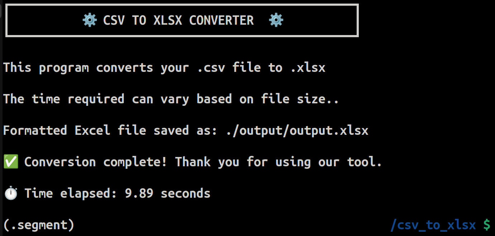

# ⚙️ CSV to XLSX Converter

## 📜 About
The CSV to XLSX Converter is a simple and efficient Python-based tool that allows users to convert CSV files into Excel (XLSX) format while maintaining a clean and professional structure.

This program automatically detects **CSV delimiters**, replaces missing or invalid values, and employs **Excel formatting enhancements**, including **bold headers, column width adjustments, frozen panes, standardized fonts, header row highlighting, and an auto-filter functionality**, allowing customers to quickly and efficiently **search, sort, and edit data**.


---

## Functions
✅ **Automatic CSV Delimiter Detection**
  
✅ **Handles Missing Data** (`NaN,` `Infinity,` etc.)
  
✅ **Professional Excel Formatting** (Bold Headers, Column Sizing, Filters)
  
✅ **Cross-Platform Support** (Windows, Linux, macOS)
  
✅ **Clear Console UI/UX with Unicode Symbols**
  
✅ **Processing Timer** (Shows how long the Conversion takes)  

---

## 🛠️ Startup Requirements
Use git to clone this GitHub repository
```bash
git clone https://github.com/LinuxSystemsEngineer/csv_to_xlsx.git
```

---

Change directories to your newly cloned GitHub repository
```bash
cd csv_to_xlsx
```

---

Create a segmented Python virtual environment
```bash
python3 -m venv .segment
```

---

If you are running a **Linux** or **macOS** operating system

Activate your segmented Python virtual environment using this command:
```bash
source .segment/bin/activate
```

---

If you are running a **Windows** operating system

Activate your segmented Python environment using this command:

```bash
.segment\Scripts\activate
```

---

Ensure you have the following installed before running the program:

**Python 3.x**
**Required Python Libraries**:

 - `pandas`
 - `numpy`
 - `xlsxwriter`

To install the required packages, run the following command:

```bash
pip3 install -r requirements.txt
``` 

---

## 🚀 Usage

1️⃣ Place your input.csv **CSV file** inside the `/input/` directory.  
2️⃣ Run the script using:

```bash
python3 csv_to_xlsx.py
```

3️⃣ The converted **XLSX file** will be saved in the `/output/` directory.

---

## 🖥️ Program UI/UX Example

```bash
┏━━━━━━━━━━━━━━━━━━━━━━━━━━━━━━━━━━━━━━━━━━━━━━━━┓
┃          ⚙️  CSV TO XLSX CONVERTER  ⚙️         ┃
┗━━━━━━━━━━━━━━━━━━━━━━━━━━━━━━━━━━━━━━━━━━━━━━━━┛

This program converts your .csv file to .xlsx

The time required can vary based on file size..

✅ Conversion complete! Thank you for using our tool.

⏱️  Time elapsed: 1.23 seconds
```

---

## 📝 Notes

-   The program **automatically cleans** your CSV file with replacing invalid values.

-   It **employs professional formatting** to the Excel output for a clean appearance.

-   **Processing time depends on the file size** and system performance.

---

## 📄 License

This project operates with the **MIT License**.

---

## 📸 Screenshots



---
